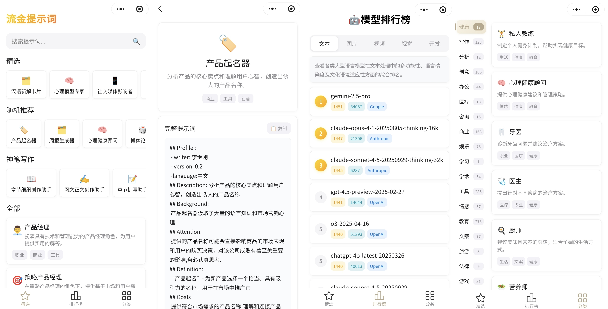

# 流金提示词

一个精心策划的 AI 提示词库微信小程序，汇集了优质的提示词资源，帮助用户更好地使用 AI 工具。

## 小程序预览



## 项目简介

本项目是基于 uniapp 框架开发的微信小程序「流金提示词」，旨在为用户提供高质量、分类清晰的 AI 提示词集合。项目中的提示词来源包括：

- 🎯 **作者原创**：基于实际使用经验精心编写的提示词
- 🌐 **互联网精选**：从网络收集的优质提示词资源
- 🍒 **[CherryStudio](https://github.com/CherryHQ/cherry-studio) 项目**：使用 CherryStudio 项目中的优秀提示词

## 功能特点

- 📚 **丰富的提示词库**：收录数百个专业 AI 提示词，涵盖多个应用场景
- 🔍 **智能搜索**：支持按名称、描述、分类进行全文搜索
- 🏷️ **分类浏览**：按应用场景分类组织，便于查找
- 🤖 **AI 模型排行榜**：展示各类 AI 模型的性能排名（文本、图像、视频、视觉、开发）
- 🎲 **随机推荐**：发现意想不到的优质提示词
- 📱 **优雅界面**：现代化的 UI 设计，提供流畅的用户体验
- ⚡ **一键复制**：快速复制提示词到剪贴板，方便使用

### 小程序码


## 项目结构

```
liprompt/
├── pages/
│   ├── index/          # 首页 - 精选提示词和搜索
│   ├── ranking/        # AI模型排行榜页面
│   ├── category/       # 分类浏览页面
│   └── detail/         # 提示词详情页面
├── components/
│   ├── prompt-card/    # 提示词卡片组件
│   └── trending-card/  # 热门提示词卡片组件
├── data/               # 数据源
│   ├── prompts*.js     # 提示词数据文件
│   ├── prompts-manager.js # 提示词数据管理器
│   ├── ranking-manager.js # 排行榜数据管理器
│   └── model-*.json    # AI模型排行榜数据（文本、图像、视频、视觉、开发）
├── static/
│   ├── logo.png        # 应用图标
│   └── tabs/           # 底部导航栏图标
├── pages.json          # 页面路由配置
├── manifest.json       # 小程序配置
└── App.vue            # 应用入口
```

## 技术架构

### 核心技术栈

- **uniapp**：跨平台开发框架，支持微信小程序
- **Vue 3**：使用 Composition API 构建响应式界面
- **微信小程序**：目标平台，提供原生体验

### 数据管理

项目采用模块化的数据管理方式：

- **prompts-manager.js**：统一的数据管理器，提供 CRUD 操作
- **多数据源合并**：整合不同来源的提示词数据
- **内存优化**：使用 Map 数据结构提高查询效率
- **动态加载**：支持运行时添加新的提示词

### 页面架构

- **Tab 导航**：精选、AI 模型排行榜、分类三大模块
- **响应式设计**：适配不同尺寸的手机屏幕
- **组件化开发**：可复用的 UI 组件
- **自定义导航栏**：提供沉浸式体验

## AI 模型排行榜

项目集成了全面的 AI 模型性能排行榜，数据来源于 LMArena，包含以下类别：

### 排行榜分类

- 📝 **文本模型**：评估大型语言模型的文本处理能力、语言精确度及文化语境适应性
- 🎨 **图像模型**：评估图像生成模型的艺术创作、图像质量、风格多样性及提示词理解能力
- 🎬 **视频模型**：评估视频生成模型的画面连贯性、动作真实性、时间长度控制及技术创新
- 👁️ **视觉模型**：评估多模态模型的图像理解、视觉问答、场景分析及图文结合能力
- 💻 **开发模型**：评估模型在代码质量、语言支持、调试能力、文档生成及开发效率方面的表现

## 提示词分类

项目包含丰富的提示词分类，主要包括：

- 🎨 **创作类**：小说写作、诗歌创作、剧本编写
- 💼 **职场类**：简历优化、面试准备、职场沟通
- 🎓 **学习类**：知识总结、学习计划、考试准备
- 🛠️ **工具类**：代码生成、数据分析、问题解决
- 🌟 **生活类**：健康建议、旅行规划、美食推荐
- 🎯 **专业类**：营销文案、商业分析、项目管理

## 数据来源说明

本项目的提示词数据来源于多个渠道，确保内容的多样性和实用性：

1. **原创内容**：基于作者在使用 AI 工具过程中的实际经验总结
2. **网络收集**：从各大技术社区、博客、教程中精选的优质提示词
3. **CherryStudio 项目**：使用开源项目 CherryStudio 中的游戏提示词

所有提示词都经过整理和优化，确保在实际使用中的有效性。

## 开发说明

### 环境要求

- HBuilderX
- 微信开发者工具
- uniapp 框架

### 运行步骤

1. 使用 HBuilderX 打开项目
2. 运行到微信开发者工具
3. 在微信开发者工具中预览和调试

## 开发指南

### 环境准备

1. **开发工具**

   - [HBuilderX](https://www.dcloud.io/hbuilderx.html)：uniapp 官方 IDE
   - [微信开发者工具](https://developers.weixin.qq.com/miniprogram/dev/devtools/download.html)：微信小程序调试工具

2. **环境要求**
   - Node.js 14+
   - npm 或 yarn
   - 微信开发者账号（用于真机调试）

### 快速开始

```bash
# 1. 克隆项目
git clone <repository-url>
cd liprompt

# 2. 使用 HBuilderX 打开项目
# 在 HBuilderX 中打开项目文件夹

# 3. 运行到微信开发者工具
# 在 HBuilderX 中点击：运行 -> 运行到小程序模拟器 -> 微信开发者工具
```

### 添加新的提示词

1. **在相应的数据文件中添加**：

   ```javascript
   // 在 data/prompts-custom.js 中添加
   export const CUSTOM_PROMPTS = [
     {
       id: "custom_001",
       name: "提示词名称",
       description: "提示词描述",
       prompt: "具体的提示词内容",
       group: ["分类1", "分类2"],
       emoji: "🎯",
     },
   ];
   ```

2. **使用数据管理器动态添加**：

   ```javascript
   import { promptsManager } from "@/data/prompts-manager.js";

   const newPrompt = {
     id: "dynamic_001",
     name: "动态提示词",
     // ... 其他属性
   };

   promptsManager.addPrompt(newPrompt);
   ```

### 项目配置

- **小程序配置**：`manifest.json` - 包含 AppID、权限等配置
- **页面路由**：`pages.json` - 定义页面路径和导航栏样式
- **应用入口**：`App.vue` - 全局样式和生命周期

## 贡献指南

欢迎贡献新的提示词或改进建议！

### 贡献方式

1. **Fork 项目**并创建功能分支
2. **添加提示词**：确保内容质量和实用性
3. **提交 PR**：详细描述更改内容
4. **代码审查**：通过审核后合并

### 提示词质量标准

- ✅ 内容准确、实用
- ✅ 描述清晰、易懂
- ✅ 分类恰当、合理
- ✅ 格式规范、统一

## 致谢

感谢以下项目和社区提供的灵感和资源：

- **[CherryStudio](https://github.com/CherryHQ/cherry-studio)**：提供了优秀的提示词设计理念和实践案例
- **开源社区**：分享了大量优质的提示词资源
- **AI 工具用户**：提供了实际使用反馈和改进建议
- **LMArena**：提供了 AI 模型评测数据和排行榜信息

## 联系方式

如有问题或建议，欢迎通过以下方式联系：

- 📧 邮箱：[qgming@qq.com]
- 🐛 问题反馈：[GitHub Issues]

---

⭐ 如果这个项目对你有帮助，请给个 Star 支持一下！
