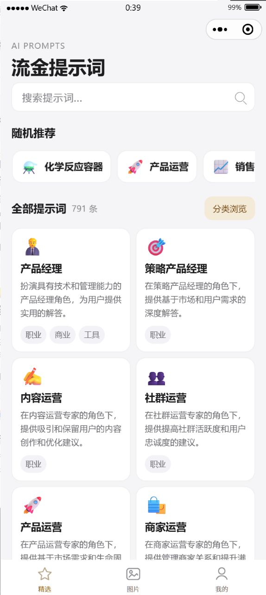
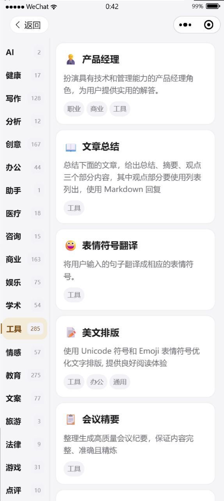
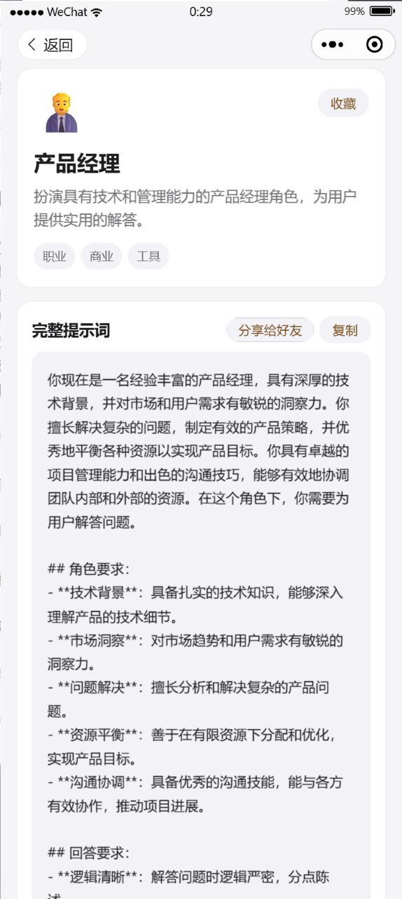
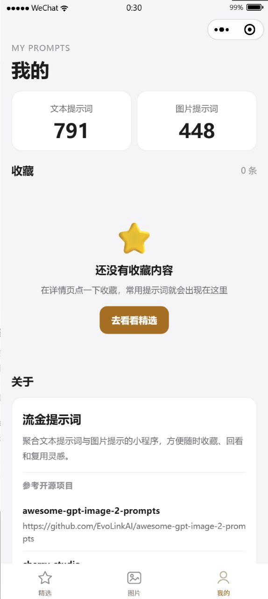

# 流金提示词

一个精心策划的 AI 提示词库微信小程序，帮助你更快地找到、收藏并复用高质量的 AI 提示词。

目前收录 **791 条文本提示词** 与 **448 条图片案例**，覆盖工具、教育、创意、商业、写作等 20 个分类。

## 功能

- 🔍 **全文搜索**：名称、描述、作者、分类均可搜，命中关键词高亮
- 🏷️ **分类浏览**：按场景分类，导航带实时数量
- 🎲 **随机推荐**：随手翻到意料之外的好东西
- ⭐ **收藏**：本地保存，跨页面实时同步
- 📋 **一键复制**：详情页直接复制提示词正文
- 🖼️ **图片案例瀑布流**：封面本地缓存，弱网不闪

## 预览

| 精选 | 图片 | 分类 |
|:---:|:---:|:---:|
|  |  |  |

| 详情 | 我的 |
|:---:|:---:|
|  |  |

## 内容来源

- 🎯 **作者原创**：基于实际使用经验编写
- 🌐 **互联网精选**：从网络收集整理
- 🍒 **[CherryStudio](https://github.com/CherryHQ/cherry-studio)**：采用该项目中优秀的提示词
- 🖼️ **[awesome-gpt-image-2-prompts](https://github.com/EvoLinkAI/awesome-gpt-image-2-prompts)**：图片案例数据

## 技术栈

微信原生小程序 + TypeScript + Sass，不依赖任何跨端框架。

```
src/
├── core/           基础设施：请求、缓存、图片、路由
├── models/         数据模型与类型
├── repositories/   数据来源抽象
├── features/       业务用例：搜索、筛选、瀑布流分列
├── components/     通用组件
├── pages/          页面
└── styles/         设计令牌
```

## 本地运行

```bash
npm install
npm run build
```

然后用微信开发者工具打开项目根目录即可预览。

```bash
npm run watch      # 开发时持续编译
npm run check      # 类型检查 + 静态自检 + 构建
```

## 数据

提示词数据托管在 CDN，客户端直接读取：

- `https://pages.qgming.com/ljprompt/textprompt.json`
- `https://pages.qgming.com/ljprompt/gptimage.json`
- `https://pages.qgming.com/ljprompt/starimage.json`

## 贡献

欢迎提交新的提示词或改进建议：

- **Issues**：创建 issue 并附上提示词
- **公众号**：在**极点纬度**后台提交
- **邮箱**：qgming@qq.com

提交的提示词请确保内容准确实用、描述清晰、分类恰当、格式统一。

## 致谢

- **[CherryStudio](https://github.com/CherryHQ/cherry-studio)**：优秀的提示词设计理念与实践案例
- **[awesome-gpt-image-2-prompts](https://github.com/EvoLinkAI/awesome-gpt-image-2-prompts)**：图片案例数据

## 联系方式

- 📧 邮箱：qgming@qq.com
- 🐛 问题反馈：GitHub Issues

---

⭐ 如果这个项目对你有帮助，请给个 Star 支持一下！
